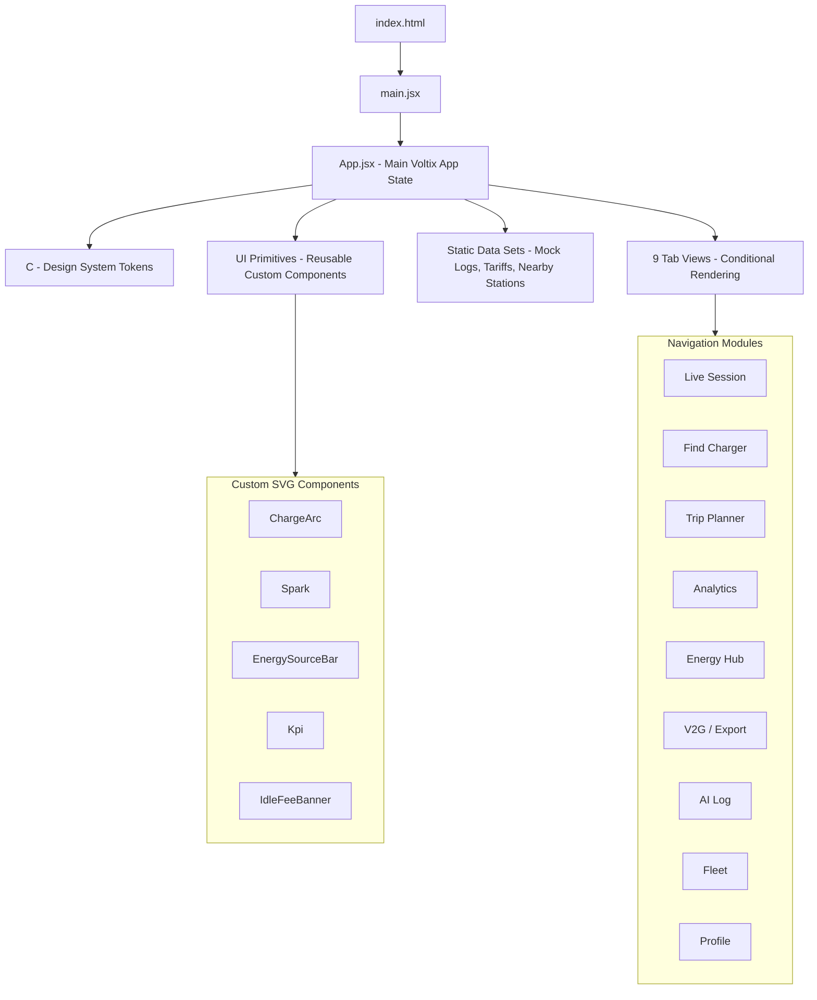

# ⚡ VOLTIX v3 — Smart EV Charging Dashboard

Voltix v3 is a complete, production-grade React application for managing EV charging sessions, optimization, and station operator telemetry. It features zero external dependencies, 9 dedicated navigation tabs, dynamic interactive states, and full grid integration controls.

---

## 📖 What Is This? (Plain English)

> [!NOTE]
> *No tech background required for this section!*

Voltix is like the ultimate companion dashboard for your electric car. When you charge an EV, a lot happens under the hood: power prices change hour-by-hour, your battery health degrades if it gets too hot, solar panels on your roof produce free energy, and the power grid experiences high-demand spikes. 

**Voltix manages all of this for you automatically and shows you exactly what it's doing in plain language.**

### 💰 Key Features Explained in Plain English

1. **Saves You Money (Off-Peak Charging)**: The app waits until electricity is at its cheapest (usually overnight) to charge your car. This saves you **38% to 44%** on your energy bill.
2. **Protects Your Battery (Battery Health)**: Fast charging in extreme heat or charging to 100% too often degrades your battery. Voltix automatically manages charge speeds and limits to keep your battery healthy years longer.
3. **Earns You Money (V2G - Vehicle-to-Grid)**: When power demand peaks in the evening (usually 5–9 PM), electricity is very expensive. Voltix can sell electricity *from your car battery* back to the power grid, earning you passive credits (averaging **$42.80/month**) while maintaining a safety reserve so you're never left stranded.
4. **Driver vs. Operator Mode**:
   - **Driver Mode**: Tailored for individual EV owners to control charging, plan trips, view home energy flows, and check local chargers.
   - **Operator Mode**: Tailored for business owners running charging stations to monitor multiple bays, manage grid load limits, track daily revenue, and address hardware faults.
5. **No "Black Box" AI**: The AI makes decisions on when to charge, discharge, or pause. Every single decision is logged with a timestamp and a plain-English explanation (e.g., *"Shifted charge start to 11:00 PM to save $1.42 tonight"*).

---

## 🚀 Quick Start

Voltix v3 has **zero external UI dependencies**. It is written using vanilla React Hooks (state, effects, refs) and custom SVG inline styling.

### 1. Requirements
Ensure you have `react` and `react-dom` installed. No Tailwind, no component libraries, and no chart packages are required.

### 2. Integration
Copy the `voltix-v3.jsx` file into your React source tree (e.g., as `src/App.jsx` in a Vite React template):

```bash
# Copy file to App.jsx
cp C:/Users/Administrator/Downloads/voltix-v3.jsx src/App.jsx

# Install dependencies (standard React packages)
npm install

# Start the local development server
npm run dev
```

### 3. Local Access
The development server will listen on:
👉 **[http://localhost:5173/](http://localhost:5173/)**

---

## 🏗 Architecture & File Structure



### File Layout
| Section | Purpose | Detail |
| :--- | :--- | :--- |
| **`const C = {...}`** | Design Tokens | Unified source of truth for colors, sizing, radius, borders, and shadows. |
| **Helpers** | Formatting & Math | `fmt(s)` translates seconds to duration strings. `clamp(v, lo, hi)` limits bounds. |
| **UI Primitives** | Visual Components | 11 reusable custom React components written in pure SVG and inline CSS. |
| **Static Data** | Data Layer | Hardcoded mock databases for charging sessions, map coordinates, AI logs, and tariffs. |
| **App State** | Context & Simulation | 35 state hooks (`useState`) and 3 simulation effects (`useEffect`) running session clocks. |
| **Conditional Tab Render** | View Layouts | Switches sidebar layouts depending on active selection and Driver vs. Operator mode. |

---

## 🗂 Feature Breakdown — All 9 Tabs

```
Nav Layout:
+------------------------------------------------------------+
| ⚡ VOLTIX    | Search stations, routes...         AJ       |
| +----------+ | ------------------------------------------- |
| |Driver|Op | |                                             |
| +----------+ |                                             |
|              |   [MAIN PAGE CONTAINER]                     |
| [ ] Tab 1    |   Renders corresponding tab content         |
| [ ] Tab 2    |   conditionally based on sidebar state.     |
| [ ] Tab 3    |                                             |
| [ ] Tab 4    |                                             |
| [ ] Tab 5    |                                             |
| [ ] Tab 6    |                                             |
| [ ] Tab 7    |                                             |
| [ ] Tab 8    |                                             |
| [ ] Tab 9    |                                             |
|              |                                             |
| [<< Collapse]|                                             |
+------------------------------------------------------------+
```

### Tab 1: Live Session
Renders two completely different viewports based on the active mode selected in the sidebar:
* **Driver View**:
  - **Live Circular ChargeArc**: Custom SVG ring that dynamically fills based on current State of Charge (SoC). Glow shadow scales based on progress, and color transitions automatically: Green (>65%), Amber (30–65%), and Red (<30%).
  - **Session Simulation**: Runs active charging counters. Updates SoC (+0.018% per second), time elapsed (+1s), energy added (+0.003 kWh per second), and cost indicators in real time. Stops automatically upon reaching the user's limit.
  - **Departure Ready By Target**: Allows selecting departure time (e.g. `07:30`) and target charge (e.g. `80%`). Calculates the exact start time required by the AI to hit the target efficiently.
  - **Manual Charge Limit Slider**: Sets target charging limits between 50% and 100%.
  - **Idle Fee Banner**: If the car is fully charged and remains plugged in, a 10-minute countdown grace period starts. Flashes amber then red as time runs out, warning the driver of the $0.10/min penalty.
  - **Power Delivery Curve Sparkline**: Active SVG path charting session charging power over time.
  - **Smart Controls**: Toggles for Off-Peak Scheduling, Demand Response, Preconditioning, Solar Sync, and V2G. Below scheduling, a range slider adjusts start time with instant color-coded explanations of cost implications.
  - **Vehicle Health Diagnostics**: 6 real-time monitoring cards showing battery/charger temperatures, cell balance, input voltage, and overall state of health (SoH).
* **Operator View**:
  - **AI Forecast Alert**: Prompts operators of peak demand windows and suggests dynamic load reductions.
  - **4-Bay Grid**: Real-time grid showing stall occupancy, vehicle type, current power draw, live Mini-ChargeArcs, and alerts (e.g., hardware fault at Bay 4, idle fee timer at Bay 3).
  - **Operator KPIs**: Displays total active sessions, power draw, daily revenue, and active faults.

---

### Tab 2: Find Charger
An interactive charger locator and booking tool.
* **Filter Pills**: 6 reactive filters (All, DC Fast, Level 2, Available, <1 mi, Plug&Charge) filter the nearby stations.
* **Expanded Details**: Clicking a station reveals details: distance, connector type, cost, amenities, and community check-in notes.
* **Stall Reservation Countdown**: Users can click "Reserve Stall", starting an 8-minute countdown timer. The interface turns green and offers a cancel link.
* **Pulsing SVG Map**: A dark-themed stylized map with coordinates representing nearby chargers (green pins represent available slots, red pins represent full/occupied ones) and a pulsing blue dot representing the user's location.

---

### Tab 3: Trip Planner
An AI trip mapping dashboard.
* **Route Planner**: Fields to plan routes with optimization goals (Fastest, Fewest Stops, Cheapest).
* **Timeline Visualization**: Click "Plan Route" to display a detailed trip timeline showing battery levels, stop durations, charge rates, and arrival times.
* **Environmental Context**: Visual indicators showing how wind speed, weather conditions, traffic, and elevation gradients affect car range.
* **Cost Comparison Chart**: A visual bar chart comparing unmanaged public costs vs. Voltix AI-optimized routing costs.

---

### Tab 4: Analytics
Comprehensive charging analytics.
* **Period Toggle**: View metrics for Week, Month, or Year.
* **AI Savings Banner**: Highlights actual spend vs. unmanaged charging cost, proving overall savings.
* **Energy Bar Chart**: Weekly energy bar charts with custom transitions and highlighting for "today."
* **Per-Session Source Breakdown**: The session history items list how much energy came from Solar, Home Battery Storage, or the Grid.

---

### Tab 5: Energy Hub
A home energy coordination dashboard.
* **Solar & Battery Telemetry**: Metrics tracking real-time solar generation, home energy draw, and Powerwall storage SoC.
* **24-Hour Grid Price Chart**: Sparkline graphing hourly utility rates. Peak periods are highlighted in red ($0.28/kWh).
* **Live Energy Loops**: Visual cards demonstrating immediate power flows (e.g., *Solar ➔ Car*, *Powerwall ➔ Home*, *Car ➔ Grid*).

---

### Tab 6: V2G / Export
Dedicated Vehicle-to-Grid control hub.
* **Export Sparkline**: Charts V2G energy export credits over time.
* **Degradation Reserve Slider**: Limits V2G discharging (e.g., never empty below 30%) to alleviate battery wear anxiety.
* **Revenue Breakdown**: Displays categorical earnings from Peak Shaving, Frequency Regulation, Spot Markets, and Demand Response.

---

### Tab 7: AI Log
Audit log providing absolute transparency.
* **Categorized Filters**: View logs by Savings, Schedules, Grid Signals, Export, or Faults.
* **AI Goal Selector**: Radio cards to choose between *Minimise Cost*, *Maximise Green Energy*, or *Protect Battery Life*, altering AI decision priorities.
* **Locked Safety Limits**: Lists locked constraints (e.g., maximum temperature 45°C) that the AI is programmatically blocked from overriding.

---

### Tab 8: Fleet
Operator telemetry for fleet management.
* **Fleet Status Grid**: Individual tracking cards for every vehicle (Model 3, Chevy Bolt, Ford F-150, Rivian R1T) showing current drivers, SoC bars, and locations.
* **Schedules & Warnings**: Detailed timelines for upcoming dispatches and maintenance alerts.

---

### Tab 9: Profile
Personal driver account summary.
* **User Profile & Badges**: Displays achievements earned (e.g., *Eco Warrior*, *Night Owl*) and total lifetime metrics.
* **Payment Methods**: Add and toggle default payment cards or RFID tags.
* **Settings Directory**: Quick access options for roaming networks, security, and support.

---

## 🎨 Design System

Voltix v3 uses a dedicated light-mode aesthetic with dark-blue details and HSL-tailored accents:

```css
/* Color Palette Reference */
--bg: #F8F9FB;          /* Light cool grey background */
--surface: #FFFFFF;     /* White card backdrops */
--border: #E8ECF0;      /* Light border dividers */
--accent: #1D6FEB;      /* Voltix Blue Accent */
--green: #16A34A;       /* Normal charging / health status */
--amber: #D97706;       /* Mid-peak pricing / warning status */
--red: #DC2626;         /* Peak pricing / emergency fault status */
--purple: #7C3AED;      /* V2G / Premium tier branding */
--teal: #0D9488;        /* Solar & Eco indicators */
```

### Micro-Animations
The JSX file includes custom CSS animations defined in its core `<style>` block:
* `@keyframes slideIn`: Moves notification panels and drop-downs.
* `@keyframes pulse`: Adds a soft glow pulsation to map nodes and active charger indicators.
* `transition`: Clean transitions on sliders, sidebar expansion, and hover-triggered cards.
